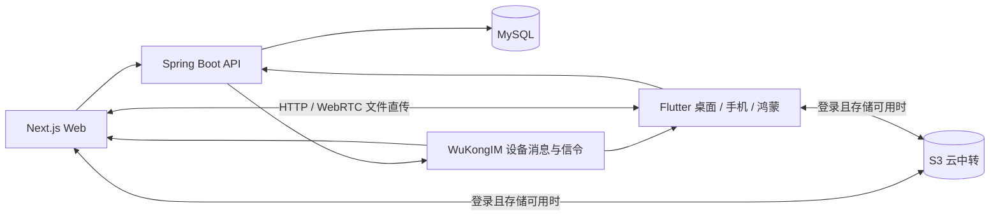

# 项目现状与下一步（更新于 2026-09-21）

最新：用户批准的全页面方案已落到 Flutter、Web、官网和管理后台。界面、设备会员、Docker 本地部署与真实文件传输验证见 [9 月 21 日实施记录](testing/2026-09-21-redesign-implementation.md)。鸿蒙本轮暂缓。以下 9 月 20 日盘点保留为历史背景，后续结果优先于早期建议和待验收项。

基线：`dab3b88`。重点核对 9 月 19–20 日提交，并追溯 9 月 18 日的悟空 IM / 鸿蒙迁移。这是代码与提交记录梳理，不代表以下跨设备场景已完成真机验收。

## 1. 当前主线

产品已经从「登录后给自己的设备同步」扩展为「设备先连接，扫码配对即可互传；账号购买和管理设备名额，设备独立配对、传输和保存历史」。下一步应先把这条链路做稳，再继续增加功能。

悟空 IM 负责消息和协商信令，不承载大文件字节。自动传输是按优先级尝试可用路径，**不是实测带宽后选最快**。

## 2. 最近两天改了什么

| 时间 / 提交 | 改动 | 当前意义 |
|---|---|---|
| 9/18 `a11e87a`、`024b9ed` | Centrifugo → WuKongIM；服务端 Docker 化；修复本地端口 / 镜像问题 | 后续部署围绕 MySQL + WuKongIM + backend |
| 9/18 `b4c236e`、`a4721c4` | 鸿蒙转入 Flutter；补 federated 插件 | `app_ohos/` 冻结，新能力进入 `app/lib` + `app/ohos` |
| 9/19 `30f587c` | 未登录设备取得设备会话、连接悟空；取消预探测 WebRTC | 设备身份和用户身份分开；发送时才协商 |
| 9/20 `3efd668`、`c52ff3b` | Web / App 游客扫码配对、WebRTC 文件互传 | 无账号也能开始使用；S3 / 账号历史仍需要登录 |
| 9/20 `7ce9312` | 游客文本通过 IM 发送 | 设备认证发送，配对关系校验，不写入账号历史 |
| 9/20 `6b47c00` | 游客额度显示、接收气泡稳定性 | 文本与信令分别限流，减少 ICE 消耗文本额度 |
| 9/20 `9dd48d7` | 移除手选传输模式，发送时自动选路 | HTTP push / pull → WebRTC → S3，按端能力与登录状态裁剪 |
| 9/20 `15b9552` | HTTP 收发和目标设备路由修正、传输阶段提示、启动容错 | 继续收尾自动选路体验；不是另起一条产品线 |
| 9/20 `dab3b88` | 合并远端历史 | 工作基线；合入的 `961049d` 属于 7 月历史，不算最近两天新功能 |

## 3. 代码地图

| 目录 / 入口 | 职责 | 后续处理 |
|---|---|---|
| `app/` | Flutter 主客户端；桌面、移动、`ohos/` | 主线维护 |
| `web/` | Next.js 网页、聊天、官网和文档页面 | 主线维护 |
| `backend/` | Spring Boot；账号 / 设备认证、配对、消息、存储、会员 | 主线维护 |
| `shared/protocol.md`、`protocol.en.md` | 跨端协议 | 功能改动同时更新 |
| `app/lib/network/transfer_path_cascade.dart`、`web/src/lib/transferPathCascade.ts` | 两端路径优先级、阶段映射、20 秒失败缓存 | 保持相同规则 |
| `app/lib/screens/chat_screen.dart` | App 聊天、传输编排与交互，基线约 10,210 行 | 回归稳定后抽出传输协调器 |
| `web/src/contexts/ChatContext.tsx` | Web 聊天状态与传输编排，基线约 2,209 行 | 同步按责任拆分 |
| `backend/.../service/MessageService.java` | 登录 / 设备消息分流与投递 | 优先验证跨身份目标投递与授权边界 |
| `app_ohos/` | 旧 ArkTS 客户端 | 已冻结；Flutter 鸿蒙上架与云传稳定前保留 |
| `config*.json`、Centrifugo 脚本与后端适配 | 旧实时方案 | 明确为历史兼容，完成迁移验收后再删除 |
| `ops/`、同步脚本 | 原生产配置 / 客户端打包配置 | 服务端配置迁往独立 env；客户端打包配置继续保留 |
| `marketing/`、`tools/` | 宣传素材与辅助工具 | 不作为业务架构入口 |

## 4. 当前已经有的规则

| 场景 | HTTP 路径 | 后续回退 |
|---|---|---|
| App → App | push，然后 pull | WebRTC，再尝试可用的 S3 |
| Web → App | push | WebRTC，再尝试可用的 S3 |
| App → Web | pull | WebRTC，再尝试可用的 S3 |
| Web → Web | 无 HTTP 服务能力 | WebRTC，再尝试可用的 S3 |
| 游客发送 | 按上面端能力尝试 | 不加入 S3 |
| S3 虚拟会话 | 无 | 仅登录且 S3 已配置、在线时可用 |

免费设备每 60 秒 90 条轻量消息、600 次普通信令/新协商；设备授权后正常使用不扣商业额度。授权与传输计数已放入共享数据库，已准入 WebRTC 会话有独立后续协商预算。传输路径失败缓存 20 秒，网络切换、重试和缓存全命中时的用户体验应进入回归。

## 5. 为什么感觉乱

1. **文档口径落后。** `PROJECT_PLAN.md` 仍是 Centrifugo、登录后通信、手选 LAN/WAN 的早期设计。本文件作为当前入口，旧文档标记历史，避免误导后续实现。
2. **业务状态混在页面中。** 配对、身份、信令、传输、气泡、重试都在大文件里；先补边界验证再拆分，避免整理代码时改变行为。
3. **配置入口过多。** 根 `.env`、`backend/.env`、`web/.env.local`、ops 同步的 profile YAML、部署脚本导出的默认值互相覆盖。旧脚本还把生产 YAML 打进镜像。
4. **部署没有闭环。** 基线 Compose 只有三个服务，Web 依赖宿主机 Node；所谓非交互部署仍有 `read` 提示；MySQL 文档还存在宿主机 3306 / 实际 3307 不一致。
5. **“已编码”和“已验收”缺少区分。** 近期 Flutter / backend 增加了测试，但 Web `package.json` 没有 test 入口；跨身份、跨端、失败回退仍需真实场景验证。

## 6. 本轮落地：部署收敛

- `scripts/deploy.sh`：全 Docker 生产入口，构建成功后再更新容器，等待健康检查；不再拉代码、询问集群、同步 ops 或强杀宿主机端口。
- `compose.production.yml`：MySQL、WuKongIM、backend、Web 四个服务，数据库和 IM 数据持久化；集群配置由 env 指定。
- `.env.production.example` → `.env.production`：生产唯一人工填写文件，域名、端口、数据库、JWT、加密密钥及第三方参数集中维护；可放到仓库外。
- `docker/production.yml`：固定生产默认值和变量映射，运行时只读挂载；关闭开发密钥回退和模拟支付，不需要逐环境改它。
- Web 增加容器构建和明确的 API / WS 地址覆盖；`NEXT_PUBLIC_*` 修改后要重建 Web。
- `scripts/deploy-legacy.sh`：保留原入口供迁移期间参考；本地 `start-dev.sh` / `docker-compose.yml` 保持原用途。

详见 [部署指南](SELF_HOST.md)。本轮没有操作生产机器、替换线上数据卷或生成真实生产密钥。

## 7. 下一步顺序和验收标准

### P0：先完成新部署与主链路验收

1. 在有 Docker 的测试机执行全新部署，检查四个服务健康；验证 `/chat`、文档静态资源、API 与 `/wkws`。再验证重启后设备与数据仍在。
2. 旧实例迁移演练：沿用数据库、项目名和加密密钥；核验旧历史和已保存 S3 凭据可读取；确保 Web 只运行一份。
3. 用下面矩阵验证最近两天主线；每次记录身份、端、实际路径、耗时、失败阶段和接收结果。
4. 重点审查设备令牌与用户令牌边界，以及登录态对外部设备的定向发送。当前新增 `publishDirectedToExternalDeviceIfNeeded` 直接投递外部 deviceId，需补充确认配对校验与发送者身份约束；不得将“已登录”等同于可向任意设备投递。

| 维度 | 必测样例 | 通过标准 |
|---|---|---|
| 身份 | 游客↔游客、游客↔登录、同账号双端、不同账号已配对 | 目标端正确收到；未配对请求被拒绝；身份变化不串会话 |
| 端能力 | Web↔Web、Web↔App、App↔App | 按能力尝试 HTTP / WebRTC，无不可能路径长时间等待 |
| 网络 | 同 LAN、跨网、HTTP 不通、WebRTC 不通 | 合理回退；游客无 S3 时给出明确失败；登录有可用 S3 时可继续 |
| 生命周期 | 断线重连、刷新、取消、立即重试、网络切换 | 无重复气泡、重复完成、永久发送中或残留任务 |
| 额度 | 普通文本、连续 ICE、触发 429、窗口恢复 | 文本 / 信令各自计数；两端显示与服务器一致 |
| 数据 | 空文件、大文件、多文件、接收端中途离线 | 内容完整；失败可重试；进度与最终状态可信 |

### P1：把自动传输做成独立模块

先定义跨端一致的阶段 / 超时 / 取消 / 错误原因，再从 ChatScreen / ChatContext 抽出“传输协调器”。界面只订阅任务状态；设备身份与配对、IM 信令和文件字节通道分别维护。每次只迁一个责任，并用 P0 矩阵确认行为不变。

交付标准：HTTP 超时 → WebRTC → S3 的测试覆盖完整；取消之后迟到回调不能再写成功；同一传输只产生一个稳定消息身份；Web 增加可重复运行的选路回归入口。

### P2：完成迁移收尾

在 P0 / P1 通过后，再清理 Centrifugo 的旧文档、安装脚本和回退代码；完成 Flutter 鸿蒙构建与真机验收后再删除 ArkTS 工程；将 `15b9552 update` 这类跨模块大提交改为可单独验证的小提交。

短期不建议同时重写聊天 UI、引入新消息中间件或扩展会员功能。优先交付一个“免登录配对 → 自动传输 → 失败可恢复 → Docker 可复现部署”的稳定版本。

## 8. 本轮验证记录

- 通过：部署脚本语法；模拟 Docker 命令验证配置路径（含空格）、构建失败不执行更新、配置失败中止、日志与 apply 分支。
- 通过：两份部署 YAML 解析、配置项去重、Web build args 与模板覆盖一致；SSR 内部地址 / 浏览器显式地址 / 原 LAN 与公网回退行为。
- 通过：Web TypeScript 检查、修改文件 ESLint、生产 `npm run build`（55 个页面）；独立运行产物目录与 Dockerfile 对齐。
- 后续本地部署验证已通过：安装 Colima + Docker；`.env.local-deploy` 独立配置通过 Compose 校验；Web / backend 镜像构建成功；MySQL、WuKongIM、backend、Web 四容器全部健康；Web、API、文档页面返回 HTTP 200，浏览器游客设备显示“在线”。启停见 [LOCAL_DOCKER.md](LOCAL_DOCKER.md)。
- 待验收：跨设备 / 真机文件传输、旧实例数据迁移；未部署线上实例。

## 9. 本地产品改进与实测补充

后续按产品改进要求，已沿上述免登录与自动选路主线完成一轮 UI、直接接收和可靠性修复：统一 Web / macOS 标识与欢迎页，移除首次使用的登录阻塞，修复游客会话丢失、空文件、并发配对、错误成功状态、中文设备名响应、接收落盘与数据库升级等问题。已补齐上文 P0 的登录设备归属及外部配对校验，并修复长时间运行后设备凭证过期无法自动恢复的问题。四容器配置仍集中维护。

双 Web、Web → macOS、服务关闭后的局域网直传以及真实断开 TCP 后续传已经实际执行，具体证据和边界见 [2026-09-20 本地验证](testing/2026-09-20-local-validation.md)。后续优先完成 Android 文档目录直接写入、Web 持久断点和真实复杂网络验证，再拆分两端传输协调器。旧 ArkTS / Centrifugo 兼容代码暂保留，不在尚缺真机验收时批量删除。

## 设备会员已实施

新增设备授权码、购买端确认、扫码授权、名额管理、撤销与旧会员迁移；登录不占设备名额，传输不再依赖账号 JWT。见 [实施与配置](DEVICE_LICENSES.md)。

## 2026-09-21：设备状态与改名细节

设备资料与在线会话独立于账号：15 秒心跳、45 秒租约、实时通知；已修复跨端改名、独立备注、乱序状态覆盖、Mac 后台在线及浏览器多窗口连接冲突。免登录 LAN 注册已移除旧账号接口，避免误跳登录页。Web、Mac 和本地 Docker 均已更新并完成回归，详见 [梳理与测试记录](testing/2026-09-21-device-details.md)。

## 2026-09-21：Android 真机互传与续传

已启动连接的 Xiaomi Android 16 真机，完成 14 个页面检查、与 Mac 的双向 HTTP / WebRTC 文件及文本测试、Web → Android 文件及文本测试。默认 Downloads 在 Android 11+ 通过系统创建文件并直接写入，修复发布后的文件路径变化、断流未关闭文件句柄、启动连接竞争和离线自动配对未捕获异常。64 MiB 文件在 Flutter 运行时重启、API / 信令不可达后从 1 MiB 断点完成续传并通过哈希校验；恢复连接后自动在线。29 项回归测试和两项真机集成测试通过。

本地 Android 调试包现已独立安装，启动脚本先执行保留数据的安装检查，签名冲突时中止。首次启动曾因 Flutter 自动安装回退卸载旧调试包，旧应用内数据可能已清除，详见 [Android 真机测试记录](testing/2026-09-21-android-device.md)。自定义文档目录直写、完整进程被系统杀死后的恢复、跨公网复杂网络仍待后续验证。

## 2026-09-21：离线文本发送补充修复

用户真机复测发现文件能发、文本失败。定位为游客文本仍强制走服务器，而手机本地服务转发已断开。首次发送和重试现已统一为优先局域网、再走设备信令的流程，并补充超时和稳定消息身份。手机免登录、服务不可达时实际发送中文表情、多行和长文本及失败重试全部成功，Mac 接收内容逐条一致，重复投递无重复记录。详见 [原因与验证](testing/2026-09-21-offline-text-fix.md)。

## 2026-09-21：重复手机条目清理与身份探测

Mac 上的同名手机来自真机测试重装前后的两个安装身份，旧服务器配对未清理；仅探测 HTTP 地址还会将旧身份误判在线。已通过客户端移除旧配对，已知设备探测改为核对设备 ID，删除时忽略过期快照。Mac 原生 UI 验证只剩现用手机，18 项回归通过。详见 [重复设备排查记录](testing/2026-09-21-duplicate-device-fix.md)。
