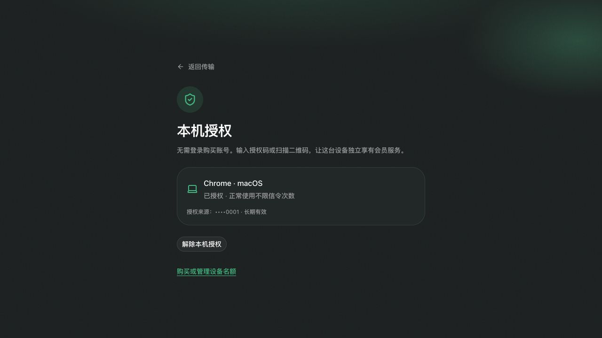
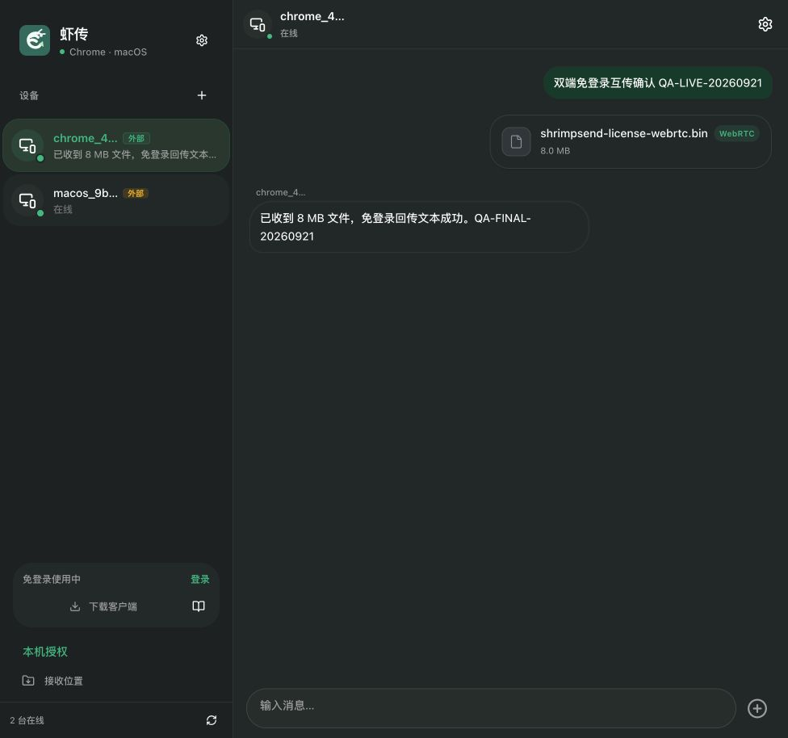

# 设备授权与传输验收 — 2026-09-20 至 21

## 已完成

按「账号购买名额，设备独立使用」实施后端、Web 与 Flutter macOS。购买者生成一次性六位码或二维码，目标设备不用登录购买账号；后台记录权益归属，不自动建立配对、共享历史或开放其他设备的消息。独立配置、迁移、限频和旧会员名额处理见 [实施说明](../DEVICE_LICENSES.md)。

本地 Docker 使用真实 MySQL、WuKongIM 和生产构建 Web；Mac 使用本地 Debug 客户端。测试购买者是 `device-license-qa@local.invalid`，仅由本地种子脚本赋予测试权益，没有创建真实付款。凭据在忽略且权限为 0600 的 `.local/license-qa.json`；没有把密码或有效二维码写入报告。

## 实际验收

| 场景 | 结果与证据 |
|---|---|
| Web 购买者登录、生成六位码 | 成功，预留一个名额并显示有效期 |
| 未登录 Web 输入小写、带空格的码 | 自动规范化；进入等待购买者确认状态 |
| 购买者核对设备、确认 | 目标页自动变为已授权；名额从 0/3 变为 1/3 |
| 备注、撤销、重新授权 | 备注更新；撤销后目标自动恢复免费，名额释放；新二维码可重新授权 |
| 实际页面二维码截图导入 | 文件选择器上传截图，解析出授权链接；用户点击授权后直接生效 |
| 授权 Mac | 使用正在运行的 Mac 已有设备凭据兑换二维码凭证，未在 Mac 登录购买账号；设备额度返回 unlimited=true |
| 购买端授权自己，再退出账号 | 本机授权仍有效；重新加载传输页仍显示已有文字和文件历史 |
| 同一码同时被两台临时设备兑换 | 真实 HTTP + MySQL：一台成功，一台 409；同一成功设备重试幂等 |
| 最后一个名额同时签发 | 真实 HTTP + MySQL：一笔成功，一笔 409，没有超发或死锁 |
| 账号与设备权限隔离 | 账号无法发送设备消息、领取别人的待收邮箱或实时凭证；设备无法访问购买者管理接口 |
| 授权归属和配对隔离 | 同一购买者授权的临时设备初始无配对，发送被拒绝；显式配对后可发送；解除配对不撤销会员 |
| Web → Mac 文本与 4 MiB 文件 | 浏览器实际发送；Mac 消息库记录稳定的 device 会话与本地用户；文件直达 Downloads，SHA-256 一致 |
| Web ↔ Web 文本 | 两个未登录来源双向可见，授权页同时打开也没有截走消息 |
| Web → Web 8 MiB WebRTC | 双端完成；宿主 Downloads 文件存在且 SHA-256 与源文件一致 |
| Mac 真实 TCP 中断续传 | 4 MiB 文件在 1 MiB 后关闭连接；从 1,048,576 字节恢复，最终内容一致；授权前后均通过 |

本轮文件证据：

- Web → Mac：`~/Downloads/shrimpsend-license-web-to-mac.bin`，4,194,304 字节，SHA-256 `2b07811057df887086f06a67edc6ebf911de8b6741156e7a2eb1416a4b8b1b2e`。
- WebRTC：`~/Downloads/shrimpsend-license-webrtc.bin`，8,388,608 字节，SHA-256 `7d212b9c884f5c77896de960ae17cc341cda43b14d6a971f34ca29ebd4badf7f`。
- 最终 Mac 续传：`~/Downloads/shrimpsend-offline-7bd2c73b4fb9.bin`，4,194,304 字节，哈希与上述 4 MiB 文件一致；续传部分在本机约 0.126 秒，不能用作跨网络速度承诺。

## 测试发现并修复

1. 请求范围的持久化会话可能在等待锁后仍返回旧授权实体。关闭 OSIV，让事务锁后的读取使用当前状态，避免并发兑换重复成功。
2. MySQL 计数初始化的 INSERT IGNORE 后再升级写锁会死锁。改为原子 upsert，真实并发重跑通过。
3. Web 授权入口误放在接收目录弹窗内。移动到始终可见的设备侧栏，游客也能找到。
4. 较慢的旧轮询可能隐藏刚生成的二维码或覆盖新的授权状态。Web/Mac 使用请求序号并在变更期间暂停周期刷新；延迟响应有 Flutter 回归测试。
5. 放大授权二维码，增加可选取的链接和复制反馈。会员页面删除重复且不会及时更新的设备计数。
6. 全站实时连接会让会员、设置和授权页抢占传输页面的消息。实时 Provider 移到传输页；同时打开授权页后的实传回归通过。
7. Web/Mac 补充 recvack；连接响应与心跳响应分别处理，避免重复触发连接生命周期；心跳无响应时重连。协议字段对照 [WuKongIM 官方 JSON-RPC 文档](https://docs.githubim.com/en/api/client-protocols/json-rpc/)，并通过真实本地 WebSocket 用例验证消息 ID 精度和接收确认。
8. 账号传输接口原有越权兼容路径收紧为设备身份；登录、登出不改变设备会话键，Web 只保存消息元数据，Mac 本地历史兼容迁移。

## 自动检查

- Backend：130 项完整测试，0 失败、0 跳过。包括代码唯一性、到期、退款、续费恢复、降级、旧会员迁移、并发兑换、配额及权限边界。
- Flutter：本轮最终相关回归 24 项全部通过，包括授权、延迟轮询、真实 WebSocket 接收确认、设备身份、数据库、会话与文件接收。授权与连接相关文件静态检查无错误；此前的其他平台存量检查问题没有冒充全仓通过。
- Web：12 项测试全部通过，TypeScript 检查与本轮修改范围 lint 通过，生产镜像构建成功。
- 最终本地四个 Docker 服务健康；Mac Debug 客户端保留运行。

脚本：`scripts/seed-local-license-qa.py` 准备专用测试购买者；`scripts/smoke-device-licenses.py` 需该购买者有三个空闲名额，只清理自己的临时数据。当前三个名额保留为本地演示授权，可在测试账号会员页解除后复跑。`scripts/smoke-native-lan.py --url <Mac 实际局域网地址>` 验证直写与断点续传。

## 验证范围

- 已实际启动 Mac；原生窗口控制工具不可用，因此 Mac 采用真实运行进程、接口、持久化数据库、文件哈希与 Flutter 界面测试验证，没有声称自动点击了全部原生按钮。摄像头实扫未做；二维码图片识别和码/链接输入已验证。
- 浏览器仍服从其下载权限。默认使用浏览器 Downloads；选择目录后流式写入。不能静默设置操作系统目录；不支持文件系统 API 时需要临时内存 Blob 交给浏览器下载，没有新增应用磁盘文件缓存。
- 本轮未创建真实收费、发送邮件或访问 S3。原有支付链路接入的会员权益作为名额来源；不表示支付平台沙箱回调已验收。
- 本轮不是公网跨 NAT、真实防火墙单向拓扑、移动端或数 GiB 压测。单向 HTTP pull、无服务端离线传输、取消和同名保护的既有验收见 [上一轮记录](2026-09-20-local-validation.md)。浏览器刷新后的持久断点、Android SAF 直接写入仍是后续平台工作。

