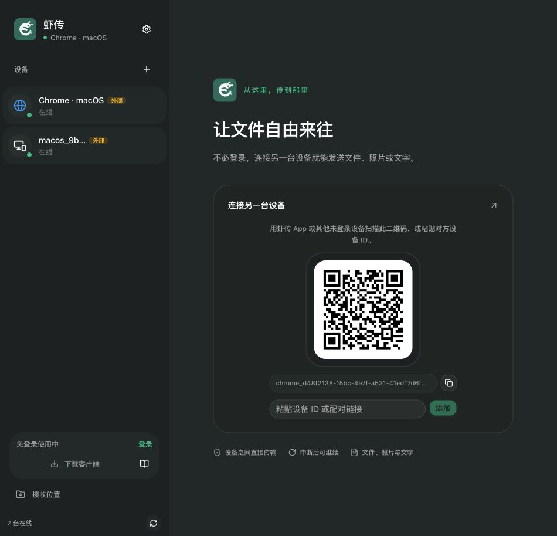
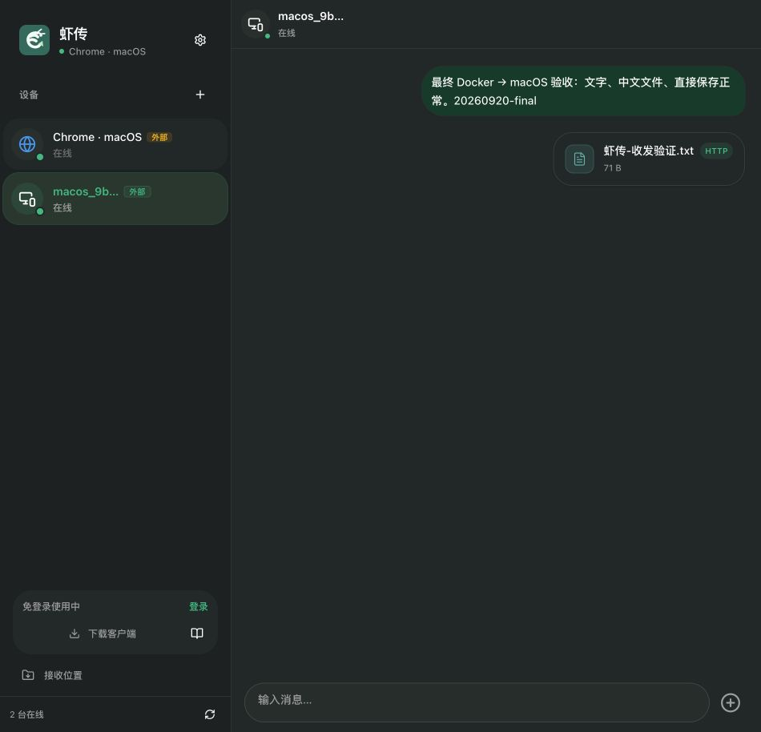

# 本地产品改进与验证 — 2026-09-20

## 本轮结果

在最近两天的「免登录配对 + 自动选路」主线上改进，没有再增加一套传输模式入口。Web 和 Flutter macOS 已实际启动。桌面接收改为直接写入 Downloads 或用户选择的目录；接收完成后不再复制一份。新的矢量虾形标识、墨绿配色、设备侧栏和欢迎页统一了两端视觉，登录保留为可选能力。

## 实际收发

| 场景 | 验证方式 | 结果 |
|---|---|---|
| 两个未登录 Web 设备互发文字 | localhost 与 127.0.0.1 两个独立浏览器来源；中文、英文、表情 | 双向显示正常；收件方未打开会话时也能保留 |
| Web → Web，WebRTC | 从真实文件选择器发送 71 B 中文文件、空文件、32 MiB 二进制文件 | 双端完成状态与接收确认正常；未取得内置浏览器下载到宿主机的最终路径，因此不标为磁盘哈希验收 |
| Web → macOS，HTTP | 自动选路；文字、71 B、0 B、32 MiB 文件 | 文字进入本地消息库；文件落在用户 Downloads；SHA-256 一致 |
| WebRTC 接收方取消 | 真实发送 128 MiB 文件，接收方中途取消 | 两端均显示已取消；传输停止，不再尝试其他通道 |
| 同名文件再次发送 | 第二次发送同一个中文名称 | 原文件保留，新文件自动添加 `(1)` |
| 消息服务关闭时直传 | 停止本项目 backend、WuKongIM，调用已运行客户端的局域网接口 | 文字接收并写入消息库成功 |
| 真正中断后的续传 | 4 MiB 文件发送 1 MiB 后关闭 TCP 连接，查询进度并继续 | 从 1,048,576 字节继续，完整 4,194,304 字节 SHA-256 一致；恢复部分本机耗时约 0.13 秒，不能作为跨设备网络基准 |
| 单向网络的 HTTP pull | 测试启动真实 HTTP 服务与接收器，发送方提供下载，接收方主动拉取 | Range 续传和内容校验通过；截断响应明确失败且保留部分文件 |
| 长时间运行后的凭证失效 | 实际发现 macOS 的设备 JWT 过期；修复后用独立测试设备与本地后端注入无效凭证 | 自动续期；12 个并发配对恢复，文字仅投递一次，待收邮箱同样自动恢复 |

32 MiB 测试文件 SHA-256：`e09320c5b00b34bb704802136c599a95b3996332ba84d7c7f21112b6231b6bd0`。

最终 WebRTC 复测：32 MiB 从开始发送到收到接收确认约 9.4 秒（含连接内的恢复握手，约 3.4 MiB/s）。这是同机两个浏览器来源的结果，不代表跨设备吞吐。发送端改为每次读取 1 MiB，再按兼容的 16 KiB 数据包发送，并保留接收确认与背压，减少逐包读取文件的开销。

最终部署的后端还通过了 12 次同时、双向发起的配对请求，全部返回成功。

部署后再次从 Docker Web 发出文字和中文文件：macOS 消息库记录 1 条对应文字，文件实际位于 `/Users/chengming/Downloads/虾传-收发验证 (2).txt`，SHA-256 与源文件一致，`cache_path` 为空、导出状态为 `done`。最终四个 Docker 服务健康，macOS 应用保留运行。

## 修复的问题

- Web 游客文字被当前选择设备过滤；切换会话又会清空消息。现在按来源和目标路由，历史合并保留正在传输和刚收到的消息。
- 重新订阅实时事件导致重复处理旧 offer、生成重复接收气泡。订阅改为稳定回调，offer 按会话去重。
- Web 与 Native 的 HTTP 发送都曾把零字节或已写满的部分文件直接当成功。现在仍完成提交和接收端最终确认。
- Web HTTP 重试保留原传输 ID，避免重试时失去断点；不同发送任务不再仅按名称、大小共用部分文件。
- WebRTC 拒绝确认、确认超时和断开不再变成成功。Native 等待文件写入结束再完成；Web 接收分批写入选择的文件夹，并移除拖慢后台发送的固定零延时定时器。
- Native 同名目标原子预留，保留已存在的文件、目录和符号链接；完成时检查大小。
- 中文设备名导致 `/device-info` 响应编码异常；现在统一 UTF-8 JSON。错误的 URL 编码文件名返回 400，不影响其他接收。
- Flutter 水平按钮布局中的无限宽约束、旧数据库重复建表失败、Dio 版本兼容问题。
- 新安装使用独立设备身份；并发初始化共享同一个 ID 和设备凭据，避免同一设备 ID 对应不同凭据。保留已有安装身份。本地 macOS Debug 版本使用独立应用标识与配置命名空间。
- 后端并发配对改为原子插入；登录账号发往外部设备前检查发送设备归属与配对；待收邮箱合并后按 ID 排序分页，避免跨来源的游标跳过未读消息。
- Web 和 Flutter 的设备凭证过期后，发送、配对、待收邮箱和额度查询会共享一次自动续期，401 请求最多重试一次。已送达、403、限流和服务器错误不会自动重复发送；续期断网失败后，后续请求仍可恢复。Web 登录邮箱重试同时改为读取刷新后的账号凭证。

## 自动化检查

- Flutter：42 项相关测试通过（38 项整组回归、增加 1 项 HTTP 输入边界回归、3 项设备凭证续期回归；新增输入用例后重新跑完 5 项 HTTP 传输测试）。另有 1 项连接本地后端的凭证续期烟雾测试通过。涵盖直接落盘、同名文件、空文件、续传、截断、会话重连、身份初始化、布局、数据库升级与路径选择。
- Web：9 项测试通过，涵盖会话隔离、历史合并、目标文件夹流式写入、并发同名保护、权限丢失、写入失败、接收确认、超时和设备凭证续期。
- Backend：110 项完整测试通过，详见本地 `backend/build/reports/tests/test/index.html`。
- 构建、类型检查和最终部署以本次运行结果为准；本报告不把单元测试代替真机和网络环境验收。

可重复执行：

```bash
npm --prefix web test
FLUTTER_BIN=/path/to/flutter ./scripts/flutter-local.sh test --no-pub test/transfer_delivery_test.dart
# Flutter macOS 正在运行时；URL 使用客户端实际局域网地址
python3 scripts/smoke-native-lan.py --url http://192.168.x.x:9080
```

烟雾测试仅创建自己的测试消息与测试文件，不删除已有下载。

## 仍需明确区分的边界

- 本次真机是 macOS。原生窗口操作工具不可用，已用实际应用进程、收发接口、消息库、文件路径和哈希验收；没有声称完成了 macOS 所有按钮的自动点击。Web 桌面已截图检查；内置浏览器未应用窄屏覆盖，不计入手机尺寸验收。
- 浏览器默认使用自身下载设置。选择文件夹后可流式写入；浏览器要求用户手势与授权，网页不能静默改变系统 Downloads。未选择目录或不支持该 API 时仍需内存 Blob 交给浏览器下载。刷新页面后的 WebRTC 续传尚未实现，不能等同于 Native 的磁盘断点续传。[浏览器能力说明](https://developer.chrome.com/docs/capabilities/web-apis/file-system-access)
- Android SAF / MediaStore 目录仍沿用原生导出适配，尚未完成直接写入 ContentResolver 的重构；本轮没有 Android、iOS、Windows 或鸿蒙真机验收。
- 邮件、短信和 S3 没有本地测试凭据，未冒充完整登录界面和云中转验收。登录消息授权与投递有后端回归覆盖。
- 局域网离线已实测；跨 NAT、TURN、真实防火墙单向拓扑、数 GiB 文件、进程重启续传还应加入后续验证。自动选路优先 HTTP，再 WebRTC，再可用 S3，并非实时带宽竞速。

## 后续顺序

1. Android 的 SAF / MediaStore 直接写入适配，以及 Web 已授权目录中的持久断点。
2. 用两台物理设备补充防火墙单向网络、跨 NAT、长时间断网和 GiB 级吞吐测试。
3. 将大体量 ChatScreen / ChatContext 中的传输编排抽为独立协调器；沿用本轮回归，逐步统一任务状态和接收确认。




